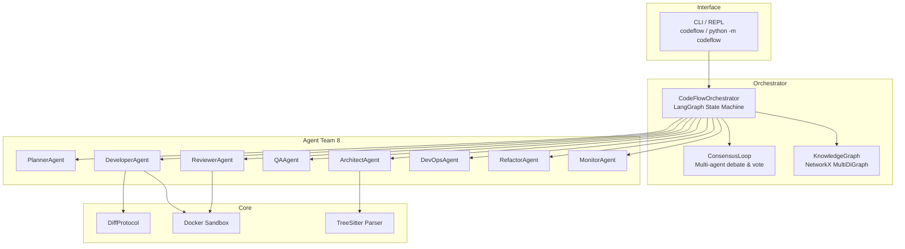
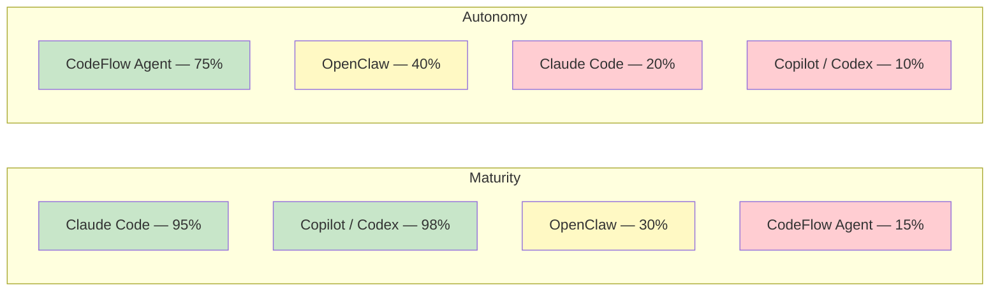
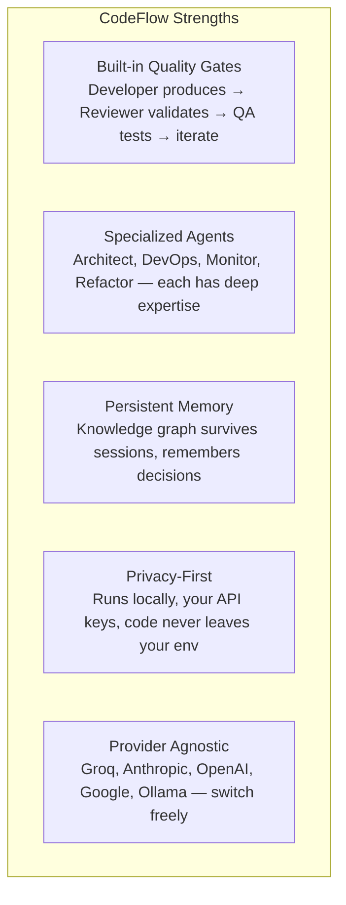
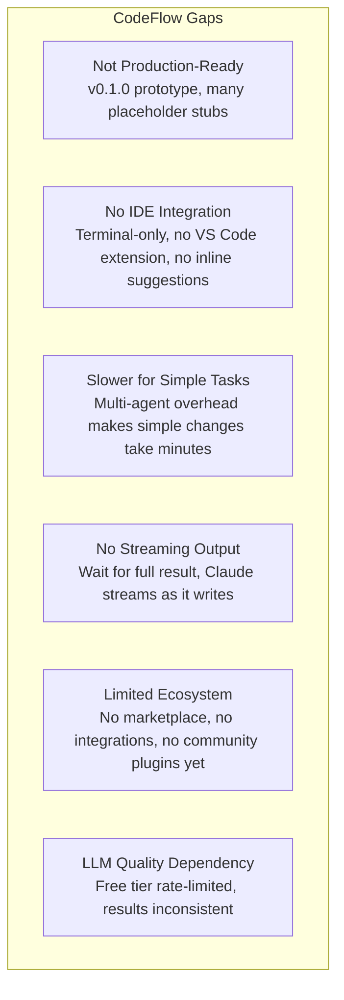
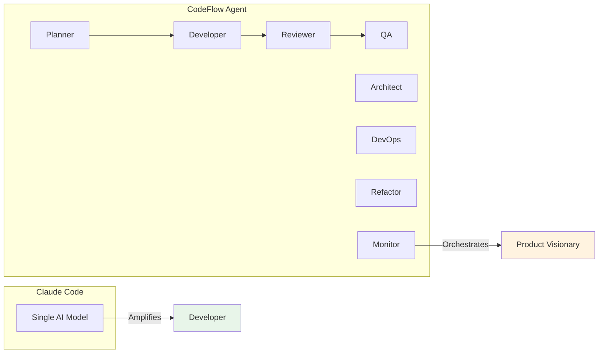

# CodeFlow Agent — Comprehensive Description & Market Comparison

---

## 📘 What It Is

**CodeFlow Agent** is an **autonomous multi-agent AI system** that orchestrates entire software development workflows. Instead of waiting for step-by-step prompts like a coding assistant, it receives a natural language requirement and autonomously plans, implements, tests, reviews, and deploys code through a team of **8 specialized AI agents** working in coordination.

---

## 🏗️ Architecture



---

## 📦 Core Components

| Module | Files | Purpose |
|--------|-------|---------|
| **CLI** | `cli.py` | Typer-based CLI + interactive REPL with autocompletion, banner, slash commands |
| **Orchestrator** | `workflow.py`, `consensus_loop.py`, `debate_context.py` | LangGraph state machine, multi-agent debate/voting, sliding window memory |
| **Agents (8)** | `base.py` + 8 subdirectories | Each has LLM, tool registry, 3-phase lifecycle (analyze → execute → validate) |
| **Core** | `diff_protocol.py`, `knowledge_graph.py`, `sandbox.py`, `tree_sitter_parser.py` | Unified diffs, NetworkX graph, Docker isolation, AST parsing |
| **Config** | `settings.py` | 10 Pydantic sub-configs, `.env` auto-loading, YAML support |
| **Models** | `entities.py` | 17 Pydantic models: Task, WorkflowState, CodeEntity, PullRequest, etc. |
| **Protocols** | `critique.py` | Structured agent communication: CritiqueReport, DebateRound, DebateContext |
| **Tests** | 7 test files | **90 tests**, all passing |

---

## 🔧 Key Capabilities

| Capability | How It Works |
|-----------|-------------|
| **Task Planning** | LLM decomposes requirements into dependency-ordered tasks with agent assignments |
| **Code Implementation** | Developer reads/writes/creates files, generates unified diffs via DiffProtocol |
| **Consensus Loop** | Developer produces code → Reviewer + QA validate → iterate until approval or max rounds |
| **Knowledge Graph** | Parses code via tree-sitter (AST) → regex fallback → builds NetworkX graph of entities and relationships |
| **Sandboxed Execution** | Docker containers with memory/CPU limits, network isolation, timeout enforcement |
| **Git Integration** | Creates branches, stages, commits, generates PullRequest objects with full descriptions |
| **LangGraph Orchestration** | State machine: `select_task → execute_task → review_task → qa_task → continue/done` |
| **5 LLM Providers** | Groq, Anthropic, OpenAI, Google, Ollama — configurable via `.env` |

---

## 🚀 How You Use It

```bash
# Interactive mode (recommended)
python -m codeflow

> /project /path/to/your/project
> /analyze
> /execute "Add rate limiting to the API"
> /pr "Add rate limiting"
> /exit

# Or one-shot commands
python -m codeflow analyze /path/to/project -v
python -m codeflow execute "Add user authentication"
python -m codeflow pr "Add OAuth2 login"
```

---

## 📊 Codebase Stats

| Metric | Value |
|--------|-------|
| Python files | 31 |
| Test files | 8 |
| Total tests | 90 (all passing) |
| Total lines | ~8,800+ |
| LLM providers | 5 |
| Agent types | 8 |
| Config classes | 10 |
| Data models | 17 |
| Enums | 8 |

---

## 🆚 Market Comparison

### Quick Overview



### Detailed Comparison

| Dimension | **CodeFlow Agent** | **Claude Code** | **GitHub Copilot / Codex** | **OpenClaw** |
|-----------|-------------------|----------------|---------------------------|-------------|
| **Type** | Autonomous multi-agent orchestrator | AI coding assistant (single agent) | Code completion + chat assistant | Autonomous coding agent |
| **Architecture** | 8 specialized agents + LangGraph + consensus | Single Claude model with tools | Single GPT-4 model with IDE integration | Single agent with planning |
| **Multi-agent** | ✅ 8 agents with specialized roles + debate/voting | ❌ Single agent | ❌ Single agent | ❌ Single agent |
| **Consensus/debate** | ✅ Reviewer + QA validate Developer, iterate until approval | ❌ No internal debate | ❌ No debate | ❌ No internal validation |
| **Planning** | ✅ Dedicated PlannerAgent, dependency-ordered tasks | ⚠️ Implicit planning via conversation | ❌ No explicit planning | ⚠️ Basic planning |
| **Code review** | ✅ Dedicated ReviewerAgent, security, style, complexity | ⚠️ You review the output | ❌ No review | ⚠️ Self-review only |
| **Testing** | ✅ QAAgent generates + runs tests in Docker sandbox | ⚠️ Writes tests, doesn't run autonomously | ❌ Doesn't run tests | ⚠️ Can write tests |
| **Knowledge graph** | ✅ NetworkX: entities, relationships, call graphs, impact | ❌ No persistent understanding | ❌ Context-window only | ❌ No graph |
| **Tree-sitter AST** | ✅ Parses code structure, not just text | ❌ Regex/text-based | ❌ Token-based | ❌ Token-based |
| **Docker sandbox** | ✅ Isolated execution, resource limits, network isolation | ❌ Runs on your machine | ❌ Runs on your machine | ❌ Runs on your machine |
| **Git integration** | ✅ Branch, commit, PR generation | ⚠️ Runs git commands | ❌ No git integration | ⚠️ Basic git |
| **Diff protocol** | ✅ Unified diffs, fuzzy matching (3 strategies) | ⚠️ Simple diffs | ❌ No diff protocol | ⚠️ Basic diffs |
| **Self-healing** | ⚠️ Consensus loop retries on failure | ❌ No self-correction | ❌ No self-correction | ⚠️ Basic retry |
| **LLM flexibility** | ✅ 5 providers (Groq, Anthropic, OpenAI, Google, Ollama) | ❌ Claude only | ❌ GPT-4 only | ✅ Model-agnostic |
| **Privacy** | ✅ Runs locally, your API keys, data stays local | ⚠️ Sends code to Anthropic | ⚠️ Sends code to GitHub/OpenAI | ✅ Runs locally |
| **Extensibility** | ⚠️ Plugin-ready, 8 agent types | ❌ Closed system | ❌ Closed system | ⚠️ Configurable |
| **Maturity** | 🟡 v0.1.0 — many features are stubs/placeholders | 🟢 Production-ready | 🟢 Production-ready | 🟡 Early stage |

---

## 🔍 Where CodeFlow Excels



---

## ⚠️ Where CodeFlow Falls Behind



---

## 🎯 The Honest Take

### Claude Code vs CodeFlow Agent — Different Philosophies



**CodeFlow is a vision. Claude Code is a product.**

| | CodeFlow Agent | Claude Code |
|---|---|---|
| **Philosophy** | Autonomous team | AI pair programmer |
| **Best use case** | "Refactor the entire auth module and ensure all tests pass" | "Help me write this function" |
| **Interaction model** | You define the What and the Why; CodeFlow owns the How | You ask, it responds |
| **Quality assurance** | Built-in (Reviewer + QA agents) | Manual (you review) |
| **Time to result** | Minutes (multi-agent coordination) | Seconds (single response) |

### The Fundamental Difference

**Claude Code amplifies a developer. CodeFlow tries to replace the development team.**

One is a **tool**, the other is a **system**. Neither is "better" — they solve different problems.

| Scenario | Better Choice |
|----------|--------------|
| Write a function, fix a bug, understand existing code | **Claude Code** |
| Refactor a module, add a feature end-to-end, run tests, create PR | **CodeFlow Agent** (when mature) |
| Quick prototyping, exploration | **Claude Code** |
| Autonomous long-running tasks with quality gates | **CodeFlow Agent** |
| Daily coding work | **Claude Code** |
| Teams wanting AI-driven delivery pipeline | **CodeFlow Agent** |

### Where CodeFlow Could Eventually Win

**Unsupervised, long-running tasks.** "Refactor the entire auth module and ensure all tests pass" — CodeFlow's multi-agent approach with built-in QA is fundamentally better suited for this than asking Claude Code to do it in a conversation.

---

## 📁 Project Structure

```
codeflow/
├── __init__.py
├── __main__.py
├── cli.py                          # Typer CLI + REPL
├── onboard.py                      # Sync onboarding
├── onboarding.py                   # Async onboarding
├── agents/
│   ├── __init__.py                 # Re-exports all agents
│   ├── base.py                     # BaseAgent (ABC)
│   ├── architect/
│   │   ├── __init__.py
│   │   └── agent.py                # ArchitectAgent
│   ├── developer/
│   │   ├── __init__.py
│   │   └── agent.py                # DeveloperAgent
│   ├── devops/
│   │   ├── __init__.py
│   │   └── agent.py                # DevOpsAgent
│   ├── monitor/
│   │   ├── __init__.py
│   │   └── agent.py                # MonitorAgent
│   ├── planner/
│   │   ├── __init__.py
│   │   └── agent.py                # PlannerAgent
│   ├── qa/
│   │   ├── __init__.py
│   │   └── agent.py                # QAAgent
│   ├── refactor/
│   │   ├── __init__.py
│   │   └── agent.py                # RefactorAgent
│   └── reviewer/
│       ├── __init__.py
│       └── agent.py                # ReviewerAgent
├── config/
│   ├── __init__.py
│   ├── settings.py                 # 10 Pydantic config classes
│   └── global_config.py            # ~/.codeflow/config.json manager
├── core/
│   ├── __init__.py
│   ├── diff_protocol.py            # Unified diff generation/application
│   ├── knowledge_graph.py          # NetworkX-based code entity graph
│   ├── sandbox.py                  # Docker isolated execution
│   ├── tree_sitter_parser.py       # AST parsing for Py/JS/TS
│   ├── persistence.py              # StateBackend (Memory/File) + VectorIndex
│   └── code_smell_detector.py      # Shared code smell detection
├── models/
│   ├── __init__.py
│   └── entities.py                 # 17 data models + enums
├── orchestrator/
│   ├── __init__.py
│   ├── workflow.py                 # CodeFlowOrchestrator (LangGraph)
│   ├── consensus_loop.py           # Iterative feedback loops
│   └── debate_context.py           # Debate memory management
├── protocols/
│   ├── __init__.py
│   └── critique.py                 # CritiqueReport, DebateContext, etc.
tests/
├── conftest.py                     # Shared fixtures
├── test_models.py
├── test_diff_protocol.py
├── test_knowledge_graph.py
├── test_sandbox.py
├── test_tree_sitter_parser.py
└── test_consensus_loop.py
```

---

*Last updated: April 4, 2026*
